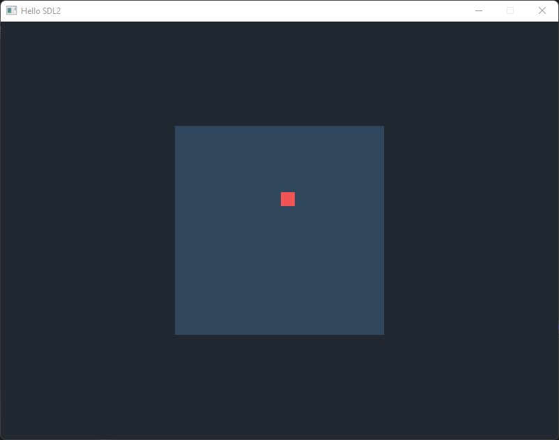

# Simple SDL2 project

This project is like a Hello World for a GUI application written in C++ and SDL2.

The application has a basic clock, and input handling. It renders a map with a player, both represented as squares. The player can be moved using the <kbd>W</kbd>, <kbd>A</kbd>, <kbd>S</kbd>, <kbd>D</kbd> keys.



## Building

### Windows

* Download the SDL2 version 2.24.0 from their [release page](https://github.com/libsdl-org/SDL/releases/tag/release-2.24.0), and extract the file in `C:\`.
* Add the path `C:\SDL2-2.24.0\lib\x64` to the `Path` Windows environment variable. Otherwise, you will need to copy `C:\SDL2-2.24.0\lib\x64\SDL2.dll` to the same folder where the `.exe` is.
* Open the solution in Visual Studio 2022.

### Linux

On Ubuntu, install this package:

```bash
sudo apt install libsdl2-dev
```

Other distributions might have a package with different name. You can also build SDL2 from sources.

After that, use make to build and run the program:

```bash
make all
./build/apps/simple_sdl2
```

